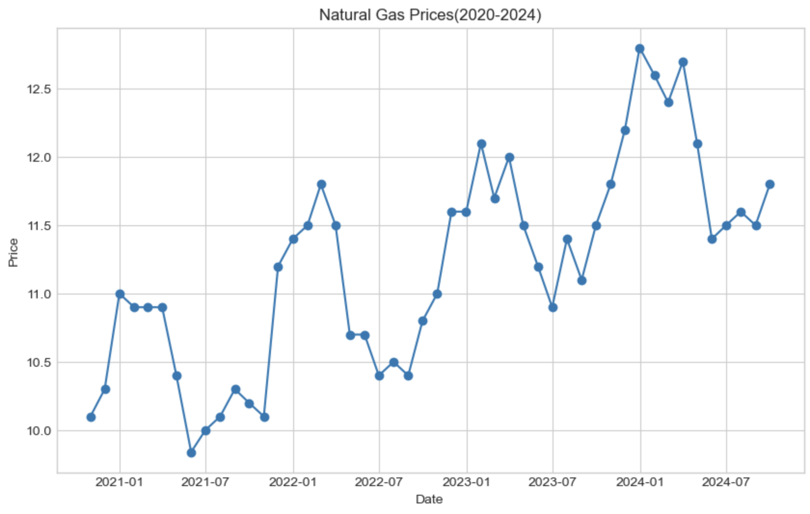
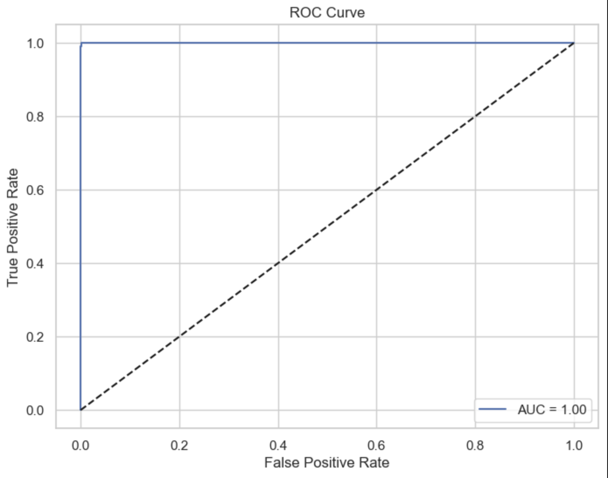

# J.P. Morgan Quantitative Research Simulation

## 📌 Executive Summary
This project showcases quantitative solutions developed for a J.P. Morgan virtual experience. It involves high-granularity time-series forecasting for **Commodity Desks** and risk-modeling for **Retail Credit Portfolios**.

---

## 📈 Workstream 1: Natural Gas Pricing & Strategy
### The Challenge
A commodities desk requires accurate pricing for natural gas storage contracts. Available market data is sparse, necessitating an extrapolation model that accounts for both long-term trends and monthly seasonal volatility.

### Methodology
1. **Trend Analysis:** Used Linear Regression to capture the multi-year trajectory of gas prices.
2. **Seasonal Decomposition:** Calculated monthly "adders" (deviations from the trend) to model price spikes during peak winter demand.
3. **Valuation Engine:** Developed a contract pricing function considering injection/withdrawal fees, storage costs, and time-value of the commodity.

#### Result Visualization

---

## 🛡️ Workstream 2: Credit Risk Analysis
### The Challenge
The credit risk desk needs a robust way to estimate the **Probability of Default (PD)** for retail loans based on historical borrower data.

### Methodology
- **Feature Engineering:** Utilized FICO scores, Loan-to-Income (LTI) ratios, and total debt levels.
- **Classification:** Trained a **Logistic Regression** model to determine default risk.
- **Validation:** Measured performance using the Area Under the Curve (AUC) and Confusion Matrices to minimize False Negatives.

#### Model Performance
| ROC Curve | Confusion Matrix |
| :---: | :---: |
|  |  |

---

## 🛠️ Technical Stack
- **Data Manipulation:** `Pandas`, `NumPy`
- **Machine Learning:** `Scikit-Learn`
- **Visualization:** `Matplotlib`, `Seaborn`
- **Math:** `SciPy` (Linear Regression and Interpolation)

---

## 🚀 How to Navigate
- `/01_nat_gas_price_prediction.ipynb`: Contains the extrapolation logic and seasonality code.
- `/02_gas_storage_contract_valuation.ipynb`: Contains the final pricing function for the desk.
- `/03_credit_risk_pd_model.ipynb`: Contains the ML pipeline for default prediction.
